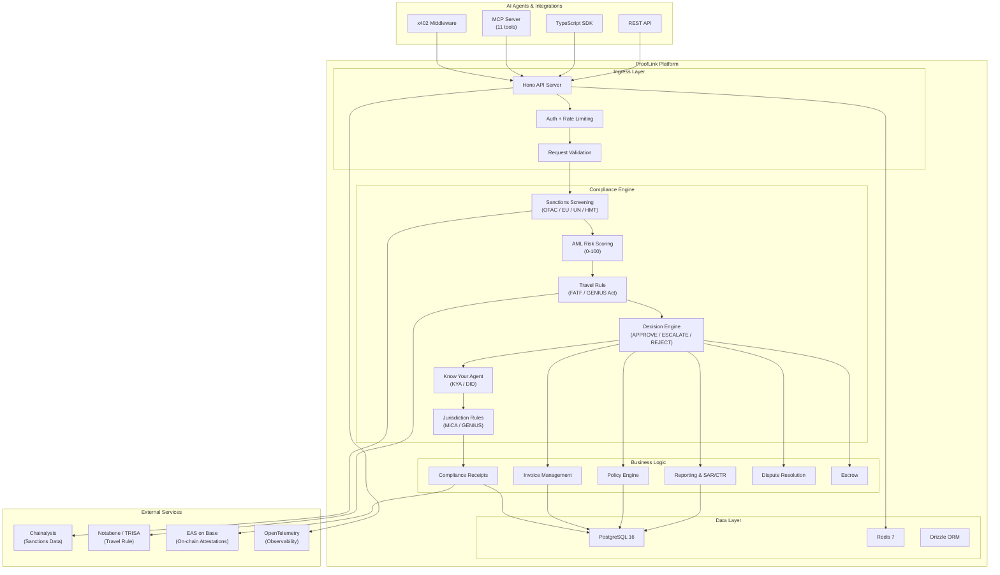
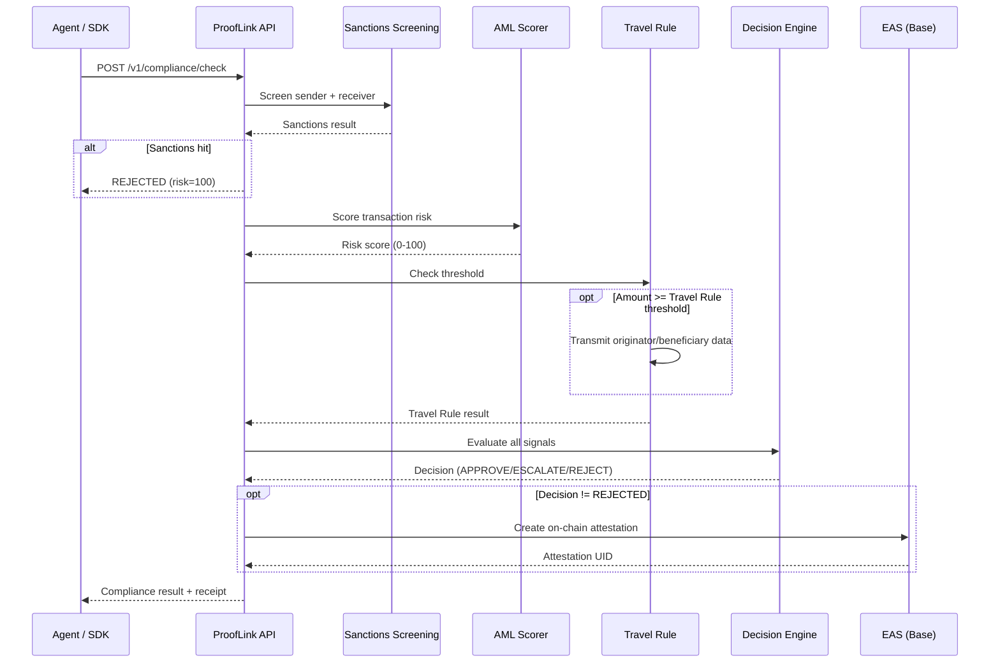
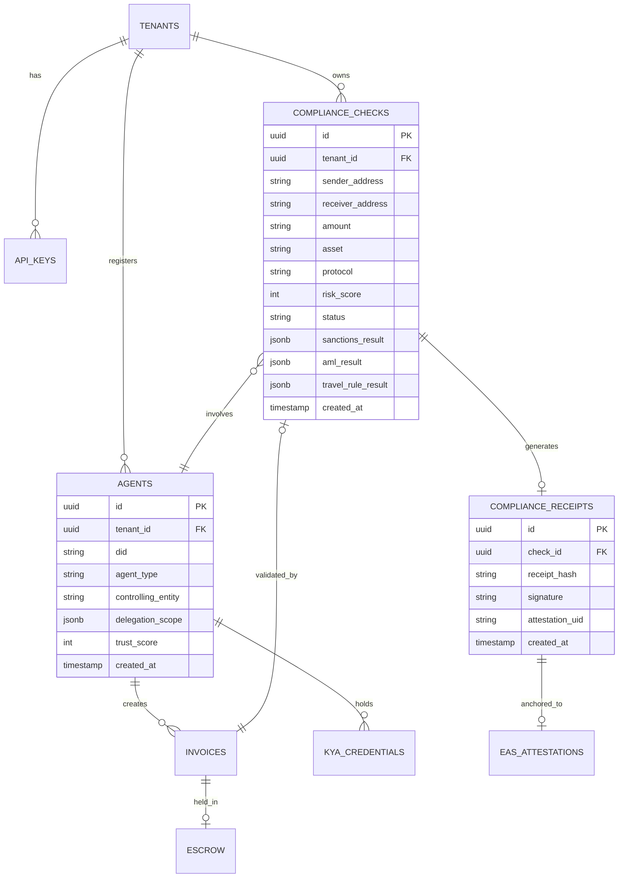
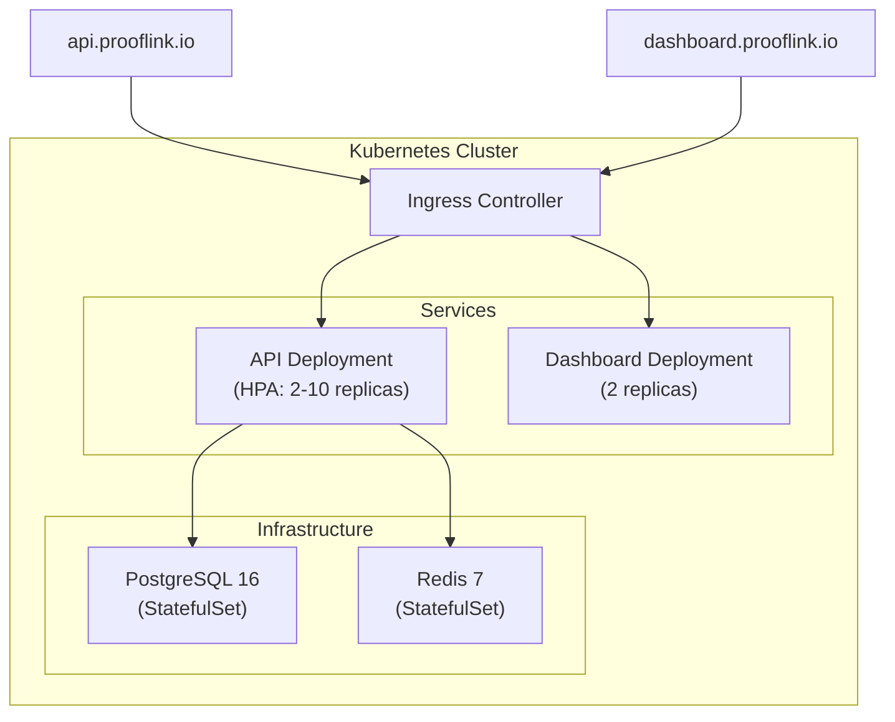

# ProofLink Architecture

## System Overview

```mermaid
graph TB
    subgraph Clients["AI Agents & Integrations"]
        x402["x402 Middleware"]
        MCP["MCP Server<br/>(11 tools)"]
        SDK["TypeScript SDK"]
        REST["REST API"]
    end

    subgraph Platform["ProofLink Platform"]
        subgraph Ingress["Ingress Layer"]
            API["Hono API Server"]
            Auth["Auth + Rate Limiting"]
            Validate["Request Validation"]
        end

        subgraph Engine["Compliance Engine"]
            Sanctions["Sanctions Screening<br/>(OFAC / EU / UN / HMT)"]
            AML["AML Risk Scoring<br/>(0-100)"]
            TravelRule["Travel Rule<br/>(FATF / GENIUS Act)"]
            Decision["Decision Engine<br/>(APPROVE / ESCALATE / REJECT)"]
            KYA["Know Your Agent<br/>(KYA / DID)"]
            Jurisdiction["Jurisdiction Rules<br/>(MiCA / GENIUS)"]
        end

        subgraph BusinessLogic["Business Logic"]
            Invoices["Invoice Management"]
            Receipts["Compliance Receipts"]
            Policies["Policy Engine"]
            Reports["Reporting & SAR/CTR"]
            Disputes["Dispute Resolution"]
            Escrow["Escrow"]
        end

        subgraph Data["Data Layer"]
            PG["PostgreSQL 16"]
            Redis["Redis 7"]
            Drizzle["Drizzle ORM"]
        end
    end

    subgraph External["External Services"]
        Chainalysis["Chainalysis<br/>(Sanctions Data)"]
        Notabene["Notabene / TRISA<br/>(Travel Rule)"]
        EAS["EAS on Base<br/>(On-chain Attestations)"]
        OTEL["OpenTelemetry<br/>(Observability)"]
    end

    x402 --> API
    MCP --> API
    SDK --> API
    REST --> API

    API --> Auth
    Auth --> Validate
    Validate --> Sanctions

    Sanctions --> AML
    AML --> TravelRule
    TravelRule --> Decision
    Decision --> KYA
    KYA --> Jurisdiction
    Jurisdiction --> Receipts

    Decision --> Invoices
    Decision --> Policies
    Decision --> Reports
    Decision --> Disputes
    Decision --> Escrow

    Receipts --> PG
    Invoices --> PG
    Policies --> PG
    Reports --> PG
    API --> Redis

    Sanctions --> Chainalysis
    TravelRule --> Notabene
    Receipts --> EAS
    API --> OTEL
```

## Compliance Decision Pipeline

```mermaid
sequenceDiagram
    participant Client as Agent / SDK
    participant API as ProofLink API
    participant Screen as Sanctions Screening
    participant AML as AML Scorer
    participant TR as Travel Rule
    participant DE as Decision Engine
    participant EAS as EAS (Base)

    Client->>API: POST /v1/compliance/check
    API->>Screen: Screen sender + receiver
    Screen-->>API: Sanctions result

    alt Sanctions hit
        API-->>Client: REJECTED (risk=100)
    end

    API->>AML: Score transaction risk
    AML-->>API: Risk score (0-100)

    API->>TR: Check threshold
    opt Amount >= Travel Rule threshold
        TR->>TR: Transmit originator/beneficiary data
    end
    TR-->>API: Travel Rule result

    API->>DE: Evaluate all signals
    DE-->>API: Decision (APPROVE/ESCALATE/REJECT)

    opt Decision != REJECTED
        API->>EAS: Create on-chain attestation
        EAS-->>API: Attestation UID
    end

    API-->>Client: Compliance result + receipt
```

## Data Model

```mermaid
erDiagram
    TENANTS ||--o{ API_KEYS : has
    TENANTS ||--o{ COMPLIANCE_CHECKS : owns
    TENANTS ||--o{ AGENTS : registers

    COMPLIANCE_CHECKS ||--o| COMPLIANCE_RECEIPTS : generates
    COMPLIANCE_CHECKS }o--|| AGENTS : involves

    AGENTS ||--o{ INVOICES : creates
    AGENTS ||--o{ KYA_CREDENTIALS : holds

    INVOICES ||--o| COMPLIANCE_CHECKS : validated_by
    INVOICES ||--o| ESCROW : held_in

    COMPLIANCE_RECEIPTS ||--o| EAS_ATTESTATIONS : anchored_to

    COMPLIANCE_CHECKS {
        uuid id PK
        uuid tenant_id FK
        string sender_address
        string receiver_address
        string amount
        string asset
        string protocol
        int risk_score
        string status
        jsonb sanctions_result
        jsonb aml_result
        jsonb travel_rule_result
        timestamp created_at
    }

    COMPLIANCE_RECEIPTS {
        uuid id PK
        uuid check_id FK
        string receipt_hash
        string signature
        string attestation_uid
        timestamp created_at
    }

    AGENTS {
        uuid id PK
        uuid tenant_id FK
        string did
        string agent_type
        string controlling_entity
        jsonb delegation_scope
        int trust_score
        timestamp created_at
    }
```

## Deployment Architecture

```mermaid
graph TB
    subgraph K8s["Kubernetes Cluster"]
        subgraph Services
            APIDepl["API Deployment<br/>(HPA: 2-10 replicas)"]
            DashDepl["Dashboard Deployment<br/>(2 replicas)"]
        end

        subgraph Infra["Infrastructure"]
            PG["PostgreSQL 16<br/>(StatefulSet)"]
            Redis["Redis 7<br/>(StatefulSet)"]
        end

        Ingress["Ingress Controller"] --> APIDepl
        Ingress --> DashDepl
        APIDepl --> PG
        APIDepl --> Redis
    end

    DNS["api.prooflink.io"] --> Ingress
    DNS2["dashboard.prooflink.io"] --> Ingress
```
